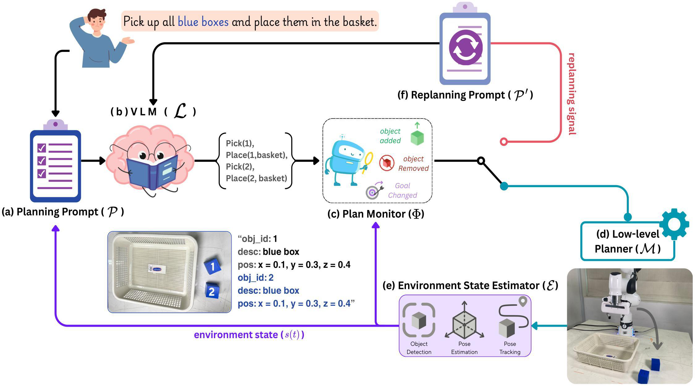
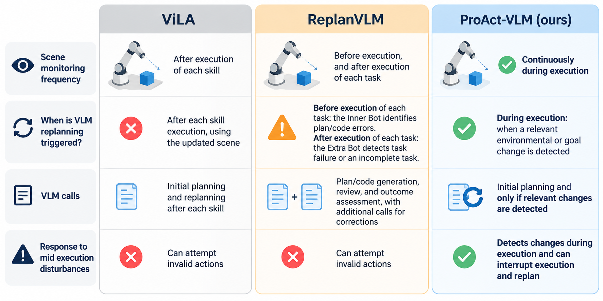
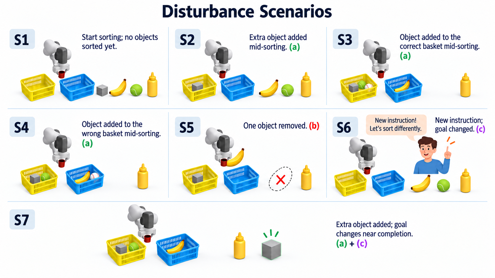
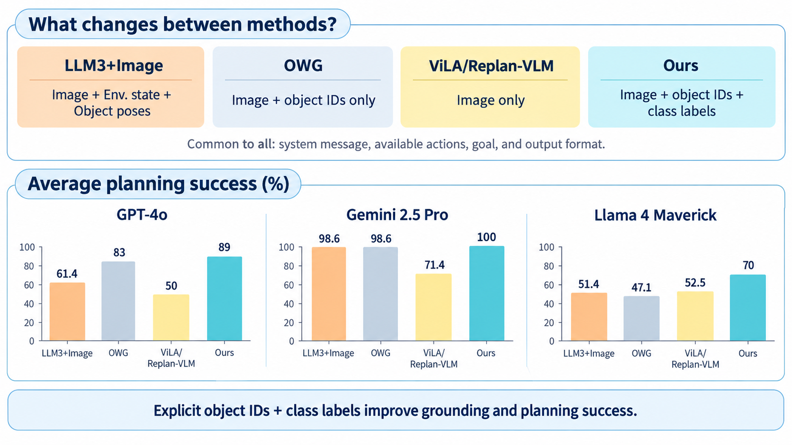

<div align="center">

# ProAct-VLM

**Pre-Failure Vision-Language Task Replanning with Continuous Perception Feedback**

Ahmed Nader Ahmed<sup>1</sup> · Omar Moured<sup>2</sup> · Mughni Irfan Mohammed Abdul<sup>1</sup> · Muhayy Ud Din<sup>1</sup> · Irfan Hussain<sup>1</sup>

<sup>1</sup>Khalifa University, Abu Dhabi, UAE · <sup>2</sup>Sereact GmbH, Stuttgart, Germany

*IEEE/RSJ International Conference on Intelligent Robots and Systems (IROS) 2026*

[](#)
[](#)
[](#)
[](#)

</div>



## About

VLM task planners replan *after* failure. **ProAct-VLM replans before it.**

- **Continuous perception feedback** — scene monitored in real time during execution, not just at discrete checkpoints.
- **Pre-failure replanning** — plan updated as soon as a task-relevant change is detected.
- **Physically grounded VLM planning** — unified visual–text reasoning over the live scene.
- **Backbone-agnostic** — higher success rates and efficiency across multiple VLMs on dynamic, long-horizon manipulation.

## vs. Prior Work

Monitors *during* execution, calls the VLM *only* when something relevant changes.



## Disturbance Scenarios

Seven sorting scenarios covering **(a)** object added, **(b)** object removed, **(c)** goal changed.



## Results

Best planning success on every backbone — GPT-4o, Gemini 2.5 Pro, Llama 4 Maverick.



## Citation

```bibtex
@InProceedings{ahmed2026proactvlm,
  author    = {Ahmed, Ahmed Nader and Moured, Omar and Mohammed Abdul, Mughni Irfan and Ud Din, Muhayy and Hussain, Irfan},
  title     = {ProAct-VLM: Pre-Failure Vision-Language Task Replanning with Continuous Perception Feedback},
  booktitle = {IEEE/RSJ International Conference on Intelligent Robots and Systems (IROS)},
  year      = {2026}
}
```
